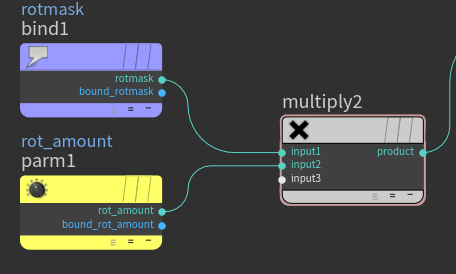
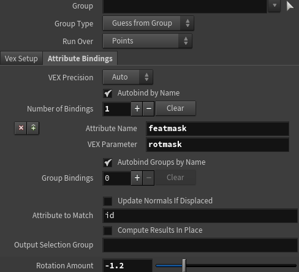

# HDAs

## Embedded Assets

[Embedded Assets](https://youtu.be/DqWRxRGe5gw?t=1099)
[Referring to embedded asset files using opdef:](https://www.sidefx.com/docs/houdini/assets/opdef.html)

```hscript
opdef:..?name
```
## Building large networks

### Autobindings

When building large networks name of parameters are likely to change, for this case Houdini gives us autobindings for VOPs and wrangle nodes.
Autobindings map an external variable name to a internal one inside the wrangle/vop




