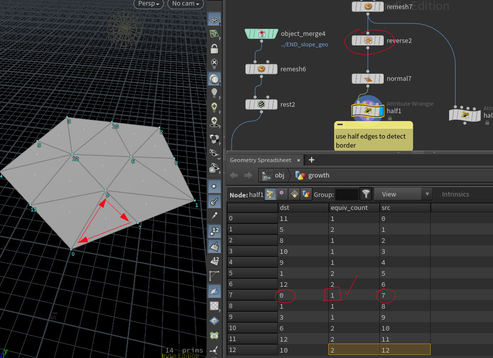
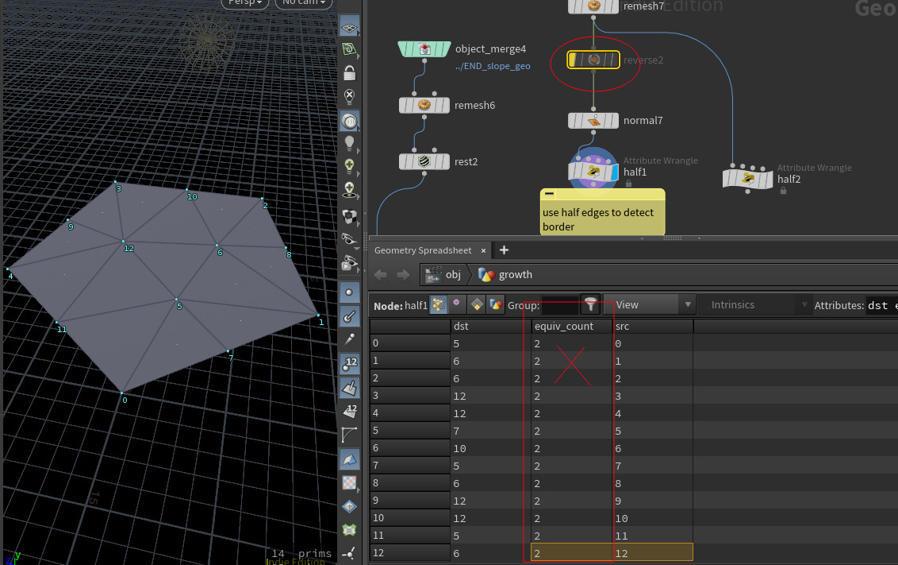

## Half edges problems and inconsistent geometry

When using the half edges data structure, make sure to have consistent normals and vertex order. In this example the mesh is correct



Now in this example the reverse node deactivated, and the normals orientation and the vertex order is inconsistent:


    
## Find border point using half edges

```vex
// Find if point is border using half edges
// only works on triangular meshes
i@is_border = 0;
int hedge = pointhedge(0, @ptnum);
//i@src = hedge_srcpoint(0, hedge);
//i@dst = hedge_dstpoint(0, hedge);
int dst = hedge_dstpoint(0, hedge);
int count = hedge_equivcount(0, hedge);
if (count == 1){
    setpointattrib(0, 'is_border', dst, 1 ,"set");
    i@is_border = 1;
    return;
}

int equiv = hedge_nextequiv(0, hedge); //turn
int hnext = hedge_next(0, equiv); //next
count = hedge_equivcount(0, hnext);
if (count == 1){
    dst = hedge_dstpoint(0, hnext);
    setpointattrib(0, 'is_border', dst, 1 ,"set");
    i@is_border = 1;
    return;
}
hnext = hedge_next(0, hedge); //the other next
hnext = hedge_next(0, hnext);
count = hedge_equivcount(0, hnext);
if (count == 1){
    i@is_border = 1;
}
return;
```
