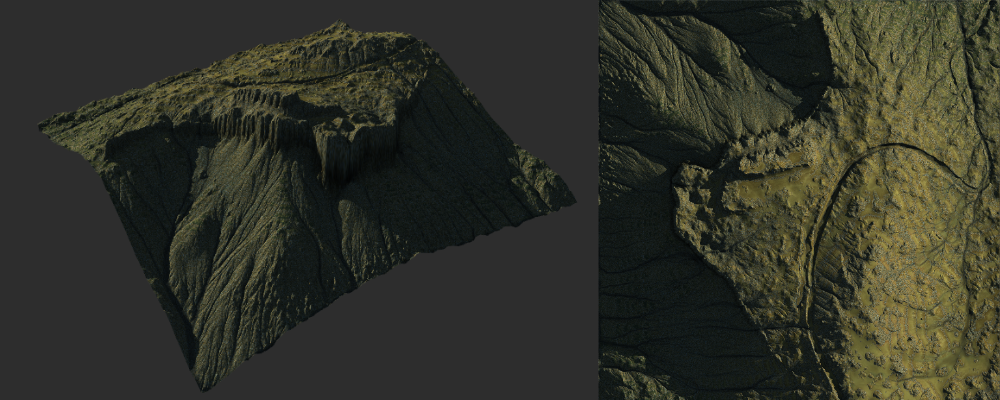
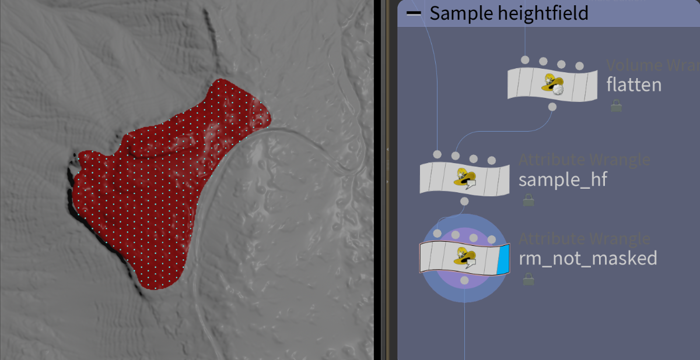
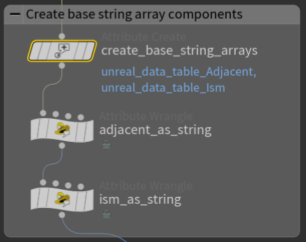
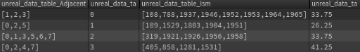
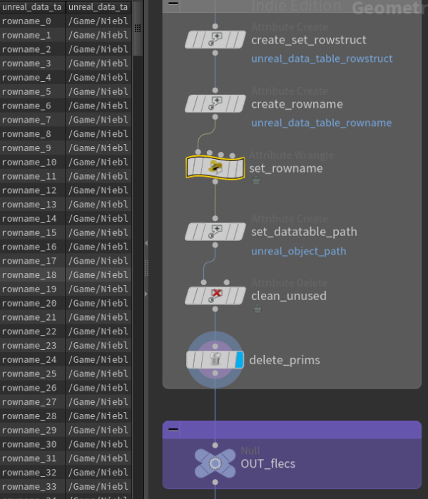
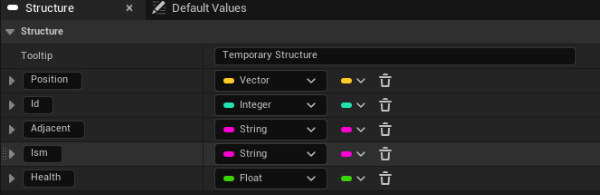
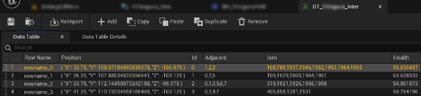
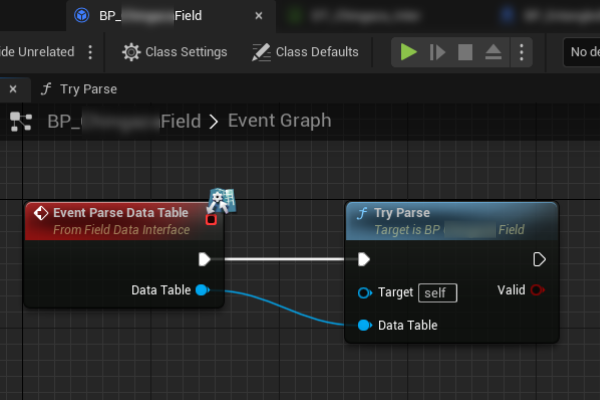

---
tags:
  - terrains
  - houdini
  - pcg
  - ecs
  - flecs
  - data
---

# Houdini to Flecs

## Intro

This document describes the process of sending point cloud data from Houdini to Unreal using Houdini Digital Asssets (HDAs). This data is used to initialize components in an Entity Component System (Flecs), and is visualized using an Instanced Static Mesh component (ISM).

### Why?

This workflow is motivated by previous attemps to have many actors in Unreal visualizing internal attributes. My previous implementations inherited from UActor or used TArrays, but somehow the object oriented paradigm did not fit my needs to have a more Houdini way of laying out the data. This is where [flecs](https://www.flecs.dev/flecs/) comes in. Flecs is an entity component system that share many similarities with the way VEX works inside Houdini :salt: By similarities I mean it in a way of thinking about data.

For a more in depth explanation about flecs you can read about it in [this article](https://ajmmertens.medium.com/building-an-ecs-2-archetypes-and-vectorization-fe21690805f9) from the creator of the ECS library.

Consider this document a sort of data table adventure, so be prepared to be exited about spreadsheets! :flushed:

### An use case

Let's pretend we have a game where the environment is the main driver of gameplay, an many of its components change overtime. Maybe there is a flow of resources from one geographical location to another, the height affects the health of the entities in a level, the wind is not uniform and depends on the interaction with other natural phenomena. This can be a sort of game that is close to being a simulation mixed with mechanics.

The key problem here is how to set the data in a game like this where manual editing and plain data tables just doesn't cut it.

<figure markdown>
  { loading=lazy }
  <figcaption>Our starting point</figcaption>
</figure>

### Data pipeline plan


We can use the tools that Houdini provides to initialize the values an use the HDA workflow to send the data over to Unreal for further processing.

## Houdini side

### Initialize base values




Taking a heightfield as the starting point, we can sample the height and set a hex grid point cloud to follow the terrain. Down stream in the graph a new attribute is created to store the adjacent points to each point as an array of integers

### Quirks of sending the HDA to Unreal

Using the HDA and Houdini engine for Unreal, we can send the heightfield and the point cloud with our attributes if they are formatted correctly, however not all data types and data structures are allowed.

#### Special types and structures

<figure markdown>
  { loading=lazy }
</figure>

The attributes "adjancent" and "Ism" are arrays of integers. The Houdini engine doesn't marshall this data structure, so we will have to send the array as a string and parse the string as an array in the Unreal side.

!!! note

    ISM stands for Instanced Static Mesh in Unreal, I will be using this value to associate a mesh instance with a specific mesh renderer.


=== "Adjacent as string "
    ```vex title="adjacent_as_string.vex"
    //Run over points
    int @adjacent[];
    string adj = "[";
    int num_adj = len(@adjacent);

    for (int i=0; i < num_adj ; i++){
       int n = @adjacent[i];
       adj += i < num_adj - 1 ? itoa(n)+"," : itoa(n);
    }
    adj += "]";

    s@unreal_data_table_Adjacent = adj;
    ```

=== "ISM as string"
    ```vex title="ism_as_string.vex"
    //Run over points
    int @ism[];
    string ism_s = "[";
    int num_ism = len(@ism);

    for (int i=0; i < num_ism ; i++){
       int n = @ism[i];
       ism_s += i < num_ism - 1 ? itoa(n)+"," : itoa(n);
    }
    ism_s += "]";

    s@unreal_data_table_Ism = ism_s;
    ```

!!! info
   
    For more info on pclouds as outputs visit the [data tables documentation](https://www.sidefx.com/docs/houdini/unreal/outputs.html#tables).
    

Once the HDA is in Unreal, the pcloud will be read by the houdini engine (Unreal) and imported as a data table *if* the setup is correct. For this to happen the attributes need to be named correctly. For example all columns in the following data table are prepended with unreal_data_table_ e.g. **unreal_data_table_Ism**



| Adjacent | Health  | Id | Ism                                     | rowname   | rowstruct                                                  |
|----------|---------|----|-----------------------------------------|-----------|------------------------------------------------------------|
| [1,2,3]  | 56.8365 | 0  | [108,788,1937,1946,1952,1953,1964,1965] | rowname_0 | /Game/ProjectName/Data/FYourStruct_Inter.FYourStruct_Inter |
| [0,2,5]  | 63.6285 | 1  | [109,1529,1803,1904,1951]               | rowname_1 | /Game/ProjectName/Data/FYourStruct_Inter.FYourStruct_Inter |

### Row name and struct path

The next set of attributes have to be extracted from Unreal and referenced in Houdini

<figure markdown>
  { loading=lazy width="300" }
  <figcaption></figcaption>
</figure>


The first attribute is ==unreal_data_table_rowname==. The value of this attribute can be set for each point with a wrangle like:

```vex
// Run over points
s@unreal_data_table_rowname = "rowname_" + itoa(@ptnum);
```

The second attribute is the path to the row struct ==unreal_data_table_rowstruct==.
This path targets an FStruct.uasset in the unreal project game folder. The path can be obtained in Unreal by selecting the uasset in the content drawer > right click > copy reference

This will store the path in the clip buffer:<br>
> _/Script/Engine.UserDefinedStruct'/Game/SomeDir/FYourStruct.FYourStruct'_

But only the part between quotes is needed:<br>
> _/Game/SomeDir/FYourStruct.FYourStruct_

!!! Warning

    Unfortunatelly structs created in c++ header files can not be used, the path needs to target an .uasset not an .h file. 

!!! Warning
    
    The path must target assets in the Game directory, if the target uasset is in the content folder of a plugin, Houdini Engine will not recognize the struct path

The data types in the Unreal __FStruct__ should mirror the desired the data types in Houdini. Attributes like the rowname, and rowstruct are not needed in the unreal FStruct and should not be included.

## Unreal side

### Unreal FStruct

The struct referenced above will be used by the Houdini Engine to create a data table. Once the HDA is imported into the engine and the asset is present in a scene the table will be populated with all the rows.

<figure markdown>

<figcaption>Struct Asset</figcaption>
</figure>

<figure markdown>

<figcaption>Data Table</figcaption>
</figure>

### Parsing the data

The pcloud with the attributes is converted into a data table, but strings in the table need to be processed and used in some way in the game.

While the environment and the game mechanics are being iterated, the data structures are also likely to change. With this in mind, it is probably a better approach to use this data table as an __intermediate__ data exchange asset. After, the data can be feed into a data parser object that can be edited in Blueprints. This will allow artists and game designers to have more autonomy over the process.

<figure markdown>
{ loading=lazy }
{ loading=lazy }
</figure>

For this example I've created an UObject that will be consumed by and BP Actor

=== "Header"
    ```cpp
    UCLASS(Blueprintable)
    class ENTANGLED_API UFieldDataContainer : public UObject, public IFieldDataInterface
    {
        GENERATED_BODY()
        void ParseDataTable_Implementation(const UDataTable* DataTable) override;
    }
    ```
=== "Source"
    ```cpp
    void UFieldDataContainer::ParseDataTable_Implementation(const UDataTable* DataTable)
    {
        UE_LOG(LogEntangled, Log, TEXT("C++ Interface Implementation"));
    }
    ```

<figure markdown>
{ loading=lazy }
</figure>


This gives us some flexibility. Since we are storing the parsed data as a TArray, some critical parts like allocating the array size and validating the data can be created in cpp.

## Flecs

Regarless of the data parsing and the flexibility in that side at some point we need to know the data types that will be used in flecs.

For the flecs part I use a design similar to the one documented by [jtferson](https://github.com/jtferson) in [Quickstart with Flecs in Unreal](https://jtferson.github.io/blog/quickstart_with_flecs_in_unreal_part_1/), albeit, with less complexity and modules. 
The flecs code is packaged in a plugin made up of 3 modules: flecs as a library, flecs as a unreal subsystem, and the gameplay module with the actual entities, components and systems. This setup is not described in this document as it is long enough to deserve its own page.

To show an use case of this system I have a:

* Entity for each point (@ptnum)
* Component keeping track of the neighbors
* Component with multiple child ISMs
* Singleton component with a ISM reference
* System to update the components values
* System to visualize the components values as an ISM attribute

```cpp
void UEntangledBasicModule::Initialize(flecs::world& ECS)
{
	Super::Initialize(ECS);
	InitComponents(ECS);
	if (!TryCreateEntities(ECS, IsmComponent, DataContainer->FieldData)) return;
	CreateGameEntity(ECS);
	InitSystems(ECS);
}
```

In this ECS setup, all the entities with a health component are getting their value from the average health of their neighbors. This setup is similar to having a solver node in Houdini with a blur attribute node running over a pcloud.

<figure class="video_container">
  <video controls="true" allowfullscreen="false">
    <source src="../rsr/houflecs/basicflecs.webm" type="video/webm">
  </video>
  <figcaption>Basic ISM update</figcaption>
</figure>


Below there is an example of a system updating the values by finding the average of their neighbors

```cpp
void UEntangledBasicModule::InitSystems(const flecs::world& ECS)
{

    const flecs::entity GameEntity = ECS.lookup("Game");
    auto SourceIdMapPtr = &GameEntity.get<FEntangledMappings>()->SourceIdMap;
    if (SourceIdMapPtr->IsEmpty()) return;
    
    ECS.system<FEntangledHealth, FEntangledAdjacent>("Average Health System")
       .iter([SourceIdMapPtr](const flecs::iter& Iter, FEntangledHealth* Health, FEntangledAdjacent* Adjacent)
            {
            const auto ECSWorld = Iter.world();
                const float DecayRate = Iter.delta_time() * 0.05;
            for (const auto i: Iter)
            {
                float HealthAverage = 0.0f;
                const auto NumAdjacent =  Adjacent[i].Values.Num();
                if (NumAdjacent < 1) continue;
                for (const auto AdjacentSourceId : Adjacent[i].Values)
                {
                    auto EntityId = *SourceIdMapPtr->Find(AdjacentSourceId);
                    flecs::entity Entity = ECSWorld.entity(EntityId);
                    HealthAverage += Entity.get<FEntangledHealth>()->Value;
                }
                HealthAverage = HealthAverage * (1/NumAdjacent);
                Health[i].Value = FMath::Lerp(Health[i].Value, HealthAverage, DecayRate);
            }
       });
```


### Visualization update frequency

One important part to highlight here is the update rate of the visualization. In this example the rate is set to one update each second. This is good enough for this case, but a better alternative would be to have different  update rates as a function of the distance to the character, or restricted to the entities in the camera frustrum. A possible starting point would be to build an [octree](https://docs.unrealengine.com/5.2/en-US/API/Runtime/Core/Math/TOctree2/) or a hashmap to have a quick way of accessing and sorting the closest entities by distance.


```cpp
    auto Renderer = GameEntity.get<FEntangledIsmRenderer>()->IsmComponent;
    
    ECS.system<FEntangledHealth ,FEntangledIsmIndices, FEntangledIsmRenderer>("Visualize Health")
        .interval(1.0)
        .iter([Renderer](const flecs::iter& Iter, const FEntangledHealth* HealthComponent,
            const FEntangledIsmIndices* IsmIndices, const FEntangledIsmRenderer* IsmRendererComponent)
            {
            for (const int i : Iter)
            {
                const auto EntityRenderer = IsmRendererComponent[i].IsmComponent;
                //if (Renderer == nullptr) continue;
                for (const auto Index: IsmIndices[i].Values)
                {
                    EntityRenderer->SetCustomDataValue(Index, 0, HealthComponent[i].Value, false);
                }
            }
                Renderer->MarkRenderStateDirty(); 
        });

```

## Future

At the end of this document it might seems unnecessary show the examples with using neighbors. But it is the starting point towards using flecs in a different way. Here is an interesting option on how to expand the use of the [ECS as a data base](https://ajmmertens.medium.com/building-games-in-ecs-with-entity-relationships-657275ba2c6c).

Flecs comes with the possibility of creating relationships between entities and components, in this example the use of a TMap to keep track of the neighbors could be changed to use relationships, and take advantage of the flecs query system.

