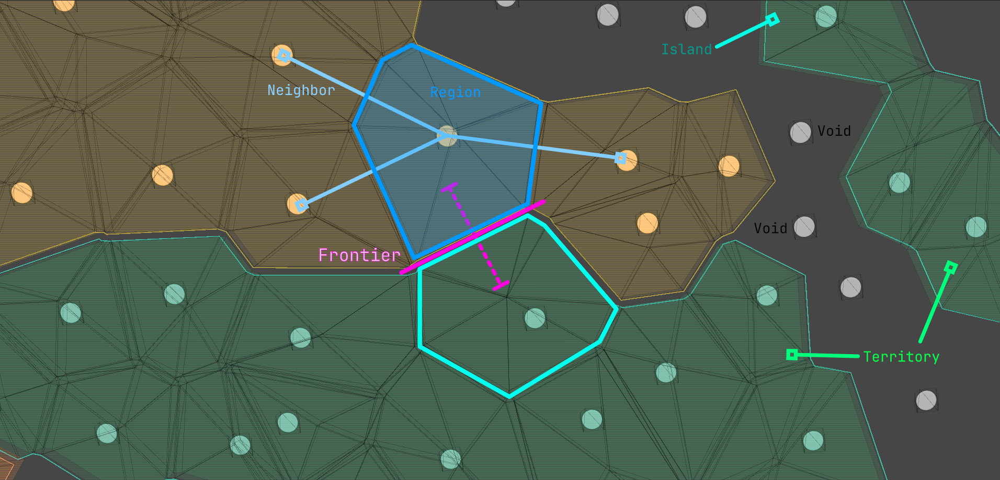
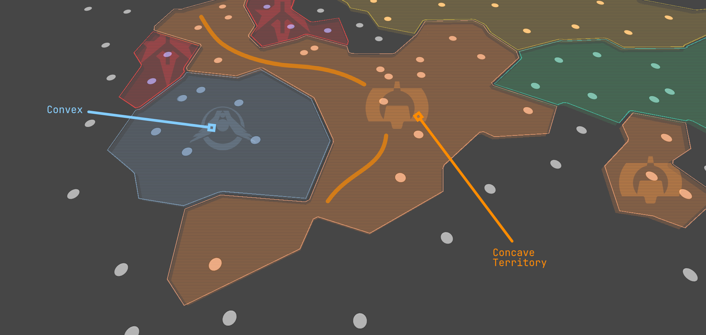

---
tags:
  - space
  - unity
  - pcg
  - computational geometry
---
# Runtime map generation

<figure class="video_container">
  <video controls="true" allowfullscreen="true">
    <source src="../rsr/mapgraph/territories.webm" type="video/webm">
  </video>
  <figcaption>Territories map generated from live data</figcaption>
</figure>

This page documents the creation process of selecting algorithms, libraries and shaders to create a runtime procedurally generated map. No specific code from the project is shared here.
## Limitations
As it was the case in the planets long read document, the hardware limitations of a mobile device were the biggest obstacle. 
The map has many heterogeneous elements(geometry with different triangle count), this meant that instancing the geometry was not an option (GPU instancing). Instead all the geometry would have to be merged to create the least amount of pieces in order to reduce the number of draw calls.
## Inputs
The game is a persistent multiplayer game, and the players can own and conquer parts of the map, this changes are visible instantaneously. A game designer controls the settings of the map (factions, owners, names) using a live spreadsheet, and the Art Director can shape the look of the map moving the centers of each star system.

!!! warning

    Data validation: The coordinates must be checked for duplicates! Otherwise the created dictionaries that map a star system to a specific part of the map will break.

## Flat data
From the code side, the data is nested inside many c# objects, and accessed through interfaces, which can make harder to have a sense of the raw data while developing the system. Because of this the first step in the development was to format the data in a flat structure, similar to how Houdini represents point/prims data.

## A map is a graph
Since our most important input is just point coordinates, it was decided that the fastest way to create geometry was to use a Delaunay triangulation library [^1]. From the triangulation we can extract the dual graph(voroinoi graph) that will become the starting point of the map.
From these two graphs we can construct the following structures:

| Structure | Characteristic                        | Graph    |
|-----------|---------------------------------------|----------|
| Center    | Star system center                    | Delaunay |
| Region    | Triangles  touching a center          | Delaunay |
| Neighbor  | Edge connection to other start system | Delaunay |
| Corner    | Vertex shared by frontiers            | Voronoi  |
| Frontier  | Edge shared by two regions            | Voronoi  |

The data structures are made up of only integers pointing to three different arrays an their indices (points, edges, triangles). Internally the delaunay graph (in this implementation) uses the *half edges* data structure[^2]. This structure allows us to walk the geometry and to find relations between the two graphs easily.

!!! note

    On helper functions: Similar to how Houdini handles half edges, several  static functions were build to travel the graphs.
    Visit: [VEX halfedges](https://www.sidefx.com/docs/houdini/vex/halfedges.html)

<figure markdown>
  { loading=lazy }
  <figcaption>Geometry from the graph</figcaption>
</figure>

## Territories
With the graphs in place, the next step was to use the remaining data to group regions, remove areas and add colors and uvs to the geometry. The additional data includes: faction color, faction name, parent factions, owner, and many other attributes that are used as filters.

| Structure | Characteristic                      | Graph       |
|-----------|-------------------------------------|-------------|
| Territory | Group of regions sharing an owner   | Territories |
| Void      | Unused geometry, shape territory    | Territories |
| Island    | Disconnected regions in a territory | Territories |

In this implementation, we use LINQ expressions to filter the data arrays. LINQ code looks small and readable, but it is not performant.
It carries a huge burden for the GC, it is important to not use it in tasks with frequent updates, in this case the generation process only happens when the data changes which can happen as low as every 1 minute, not inside an update loop.

<figure class="video_container">
  <video controls="true" allowfullscreen="true">
    <source src="../rsr/mapgraph/ownerchange.webm" type="video/webm">
  </video>
  <figcaption>Changing an owner</figcaption>
</figure>

## Classify, sort, resolve, travel graphs
After the filtering process, each territory is assembled region by region.
Depending on the neighbors of each region, an *inset geo operator* displaces the vertices inwards.
Other operators are in charge of creating the links between regions, the corners, assigning UV coordinates, etc. All the operators work following rules to decide to  create geometry and metadata.

## Center of a territory
In the map each territory is identified by a color and a banner. The banner is supposed to be in the visual center of each territory. The most expensive operator involves finding this center. On a territory with a convex shape just using the mean position of the star systems often yields a good result, but on territories that are made up of islands or that have concave shapes finding the correct center is not trivial.

<figure markdown>
  { loading=lazy }
  <figcaption>Finding the center of each territory</figcaption>
</figure>

After trying a few algorithms (Centroid Algorithm and Straight Skeleton)[^3], the best and fastest approach found was mapbox's polylabel[^4]
This algorithm expects requires exclusivelly the vertices that are in the perimeter of the shape, and the coordinates formatted using a GeoJSON-like format. In such format all vertices in a shape must be orderer sequencially, which can be hard to obtain from just using the voroinoi graph.
For this we used another geometry library as the basic foundation for our geometric types, the g3 computational geometry library.[^5] The mesh class in this library comes packed with many features, one of them is to be able to determine the outher edges in a mesh easly and to walk the other edges of a shape sequencially.

!!! info
    
    The g3 library developed for csharp has not been updated in a few years, luckly  the developer now works in a [similar library](http://www.gradientspace.com/tutorials/2022/12/19/geometry-script-faq) for Unreal Engine! 🙂

<figure class="video_container">
  <video controls="true" allowfullscreen="true">
    <source src="../rsr/mapgraph/ownerhighlight.webm" type="video/webm">
  </video>
  <figcaption>Signal received to highlight specific areas of the geometry</figcaption>
</figure>

## Collaboration and credits

The work done in this feature includes the generation of the geometry and the preparation of the data embedded in the geometry (as UVs data), the shader and the map shape were in collaboration with other team members of the art department.

[^1]: Redblob games has an easy to follow article about the [Delaunator](https://mapbox.github.io/delaunator/) library 
[^2]: [Half edges data structure](https://cs184.eecs.berkeley.edu/sp19/article/15/the-half-edge-data-structure)
[^3]: [Centroid](https://graphstream-project.org/doc/Algorithms/Centroid/) and [Straigh Skeleton](https://en.wikipedia.org/wiki/Straight_skeleton)
[^4]: 
    [Polylabel explanined](https://blog.mapbox.com/a-new-algorithm-for-finding-a-visual-center-of-a-polygon-7c77e6492fbc) and 
    [Poles of inaccessibility](ttps://sites.google.com/site/polesofinaccessibility/) article
[^5]: 
    [Computational geometry library](https://github.com/gradientspace/geometry3Sharp)
