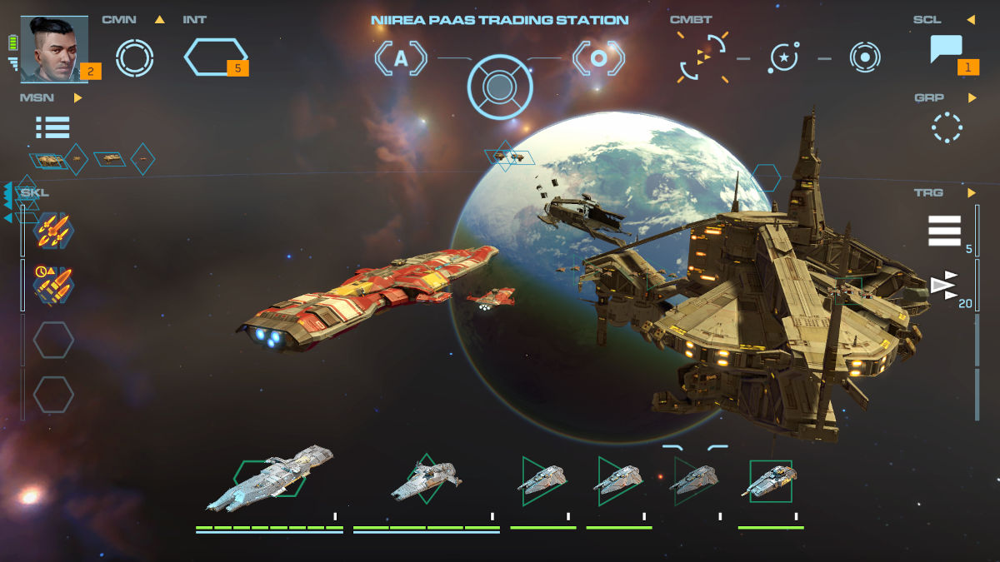
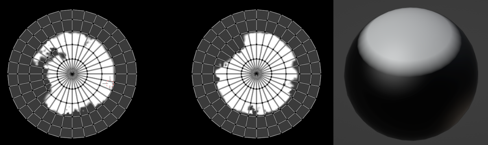

---
tags:
  - space
  - planets
  - unity
  - blender
---
# Procedural Planets
{ loading=lazy }

## Intro
This page documents the creation process of creating shaders and textures for a PCG planets system targeting mobile platforms. However the document doesn't expose any specific parts of C# code (Unity) or the code from the rendering pipeline for legal reasons.

## Previous work
As with any other work, it is important to consult previous solutions before reinventing the wheel. The best documented solution found came from another tech team in a similar game genre, [EVE online](https://www.eveonline.com/news/view/awesome-looking-planets).
In the referenced article they outline their approach in broad terms and mention the key challenges in their generation system.

A few interesting highlights from the article include:

  - The planets were generated blending height maps
  - The height maps were created by a team of artists
  - The planet shaders uses two projections to avoid texture distortions at the poles

## Resources and expectations
An important consideration for this planet generation system is the need to coexist with other systems that use many megabytes of textures in disk and memory. This left us constrained in how many textures could be loaded at one time, and the size of them.

For the generation of the height maps, the area of expertise of the artists in the team was hard surface modeling, this was at odds with the need of creating sculpted height maps and terrain features.

## Seamless projections
A texture projection over a sphere will always contain distortions at the poles. My solution was to solve this issue at the shader level using:

- Two uv sets, one with an equirectangular projection for the equator, and a planar projection for the poles.
- One mask using the planar projection uvs.
- Sphere with vertex colors, where only the poles have a white value.

<figure markdown>
  { loading=lazy }
  <figcaption>uv.1, mask and vertex colors</figcaption>
</figure>

!!! warning

    Special care should be taken when laying the uvs for the second/planar uvs, the texel density in this projection should match as closelly the one from the first/equirectangular uvs, otherwise some artifacts will be visible on close inspection.

Blending of the texture is done with two functions[^1]: 

```hlsl title="mixfloat.hlsl"
float mixfloat(float base, float blend, float opacity)
{
  float a = base * (1-opacity);
  float b = blend * opacity;
  return a+b;
}
```

```hlsl title="blendproj.hlsl"
float blendprojections(float equirect, float planar, float mask, float vertex_r)
{
  float vertex_mask = vertex_r * mask;
  return mixfloat(equirect, planar, vertex_mask);
}
```

## Blend height maps
Once the seams problem was solved, the next step was to produce a couple of height maps for the most simple type of planets, dwarf planets (no continents, no erosion). The texture channels for this type were used in the following manner:

<figure class="video_container">
  <video controls="true" allowfullscreen="true">
    <source src="../rsr/planetsbgr/fastdwarfs.webm" type="video/webm">
  </video>
  <figcaption>Basic dwarf planets blending</figcaption>

</figure>

!!! note inline end

    Bit depth is important, for a mobile platform, the maps were created at 8bit, with a good histogram distribution. For PC/Console 16bits is advised.

| channel | use                 | uv channel |
|---------|---------------------|------------|
| r       | equirect projection | 0          |
| g       | planar projection   | 1          |
| b       | poles mask          | 1          |

To create the planets variations from a limited set of height maps, two sets of textures are blended together using simple linear interpolations. the following functions are at the core of blending two texture sets.

```hlsl title="heightblend.hlsl"
float heightblend(float height1, float height2, float blend)
{
  float height_start = max(height1, height2) -blend;
  float level1 = max(height1 - height_start, 0);
  float level2 = max(height2 - height_start, 0);
  return ((height1 * level1) + (height2 * level2)) / (level1 + level2);
}
```

```hlsl title="lerpheights.hlsl"
float lerpheights(float height1, float height2, float blend, float time)
{
  float c = clamp(time)
  float h1 = (1-c) * height1;
  float h2 = c*height2;
  return blendheights(h1,h2,blend)
}
```

The color components in the fragment shader are obtained from feeding the result of the blended height map as an UV coordinate input in a color ramp. At the end the ramp is exposed to the artist as a parameter.

## Land masses

<figure class="video_container">
  <video controls="true" allowfullscreen="true">
    <source src="../rsr/planetsbgr/diversity.webm" type="video/webm">
  </video>
  <figcaption>Terrestrial and dwarfs mixed</figcaption>
</figure>

Terrestrial planets have the additional feature of having clearly defined land masses, as the product of tectonics. These land masses can be generated using a low frequency texture noise, but early tests using only noise functions resulted in spotty and fragmented continents. Instead, a very low resolution land mass generation system was created, giving better results.

The underlying process of this low frequency generation system can be summarized as follows:

  1.  Distribute a number of points over a hex tiled sphere
  2.  Each point is the start of a continent, marked with an integer id.
  3.  Expand the frontiers of the continent using a bread first search
  4.  When two continents find each other in a border, tag the collision, and resolve the ownership using the minimum id.
  5.  The tagged collisions will be used as subduction and collision zones to raise and lower the masses

<figure class="video_container">
  <video controls="true" allowfullscreen="true">
    <source src="../rsr/planetsbgr/plates.webm" type="video/webm">
  </video>
  <figcaption>Plates generation</figcaption>
</figure>

The above process is meant to be used as a starting point for land masses creation, and it is a gross oversimplification of the nature of plate tectonics.

!!! info

    [Gplates](https://www.gplates.org/screenshots/) is an interesting alternative to create these types of [simulations](https://www.youtube.com/watch?v=cxfpwyazwqw)

## Gas giants

<figure class="video_container">
  <video controls="true" allowfullscreen="true">
    <source src="../rsr/planetsbgr/bluejovian.webm" type="video/webm">
  </video>
  <figcaption>Flow at x3 speed</figcaption>
</figure>

Gas giants are very different in their surface properties and they do not work with the techniques described above. The reasons include: discontinuities in the flow of gaseous features and structures that change overtime. For these main reasons a different approach was used.

The following fragment shader is basically the code version of a blender shader described by the Entagma team in [Building a Flowmap Shader in Blender](https://entagma.com/building-a-flowmap-shader-in-blender-using-flowmap-data-from-houdini/), but with two *very important modifications*:

  * Sampling a high frequency texture with a different speed
  * Overlay the high frequency texture over the low frequency texture

The key insight here is to avoid simulating high quality/resolution vector fields for the flow of the gases, instead a tileable low resolution vector field was created to drive the distortion of two textures, a base low frequency gaseous features texture, and a high frequency details texture.

=== "Distort UVs"
    ```hlsl title="jflow.hlsl"
    half3 frag(vertexoutput i) : sv_target
    {
      float2 flow_tex = (sample_texture2d(_flowtex, sampler_flowtex, i.uv).xy * 2.0) - 1.0;
      float cycle_a = _time % 1;
      float cycle_b = (_time + 0.5)  % 1;
  
      float2 flow_coords_a = _flowspeed * flow_tex * cycle_a + i.uv;
      float2 flow_coords_b = _flowspeed * flow_tex * cycle_b + i.uv;
  
      float at_map_a = sample_texture2d(_maintex, sampler_maintex, flow_coords_a).x;
      float at_map_b = sample_texture2d(_maintex, sampler_maintex, flow_coords_b).x;
      // ...
    ```

=== "High frequency"
    ```hlsl title="jflow.hlsl"
    //...
      float2 flow_coords_c = (_flowspeed * _highflowspeed * flow_tex * cycle_a + i.uv) * _highfreqspacemult;
      float hf_map_a = sample_texture2d(_maintex, sampler_maintex, flow_coords_c).y;
 
      float2 flow_coords_d = (_flowspeed * _highflowspeed * flow_tex * cycle_b + i.uv) * _highfreqspacemult;
      float hf_map_b = sample_texture2d(_maintex, sampler_maintex, flow_coords_d).y;
  
      half3 hf_a = half3(hf_map_a, hf_map_a, hf_map_a);
      half3 hf_b = half3(hf_map_b, hf_map_b, hf_map_b);
    //...
    }
    ```

=== "Blend frequencies"
    ```hlsl title="jflow.hlsl"
    //...
      float ping_pong = abs(cycle_a * 2 - 1 );
      float low = lerp(at_map_a, at_map_b, ping_pong);

      float2 grad_coords = float2(low, 0.0);
      half3 sampled_gradient = sample_texture2d(_gradienttex, sampler_gradienttex, grad_coords);
      half3 high = lerp(hf_a, hf_b, ping_pong);
      return blend_overlay_half3(sampled_gradient, high, _freqblend);
    }
    ```

=== "Helper functions"

    ```hlsl title="blends.hlsl"
    //regular overlay mode
    half3 blend_overlay_half3(half3 base, half3 blend, float opacity)
    {
      const half3 result1   = 1.0 - 2.0 * (1.0 - base) * (1.0 - blend);
      const half3 result2   = 2.0 * base * blend;
      const half3 zeroorone = step(base, 0.5);
      const half3 result3   = result2 * zeroorone + (1 - zeroorone) * result1;
      return lerp(base, opacity, result3);
    }
    ```

<figure class="video_container">
  <video controls="true" allowfullscreen="true">
    <source src="../rsr/planetsbgr/jfrequencies.webm" type="video/webm">
  </video>
  <figcaption>Frequencies blending</figcaption>
</figure>

!!! warning
    
    For the vector field / flow map, the export and import of the texture shoudl be made with a gamma set at 1.0.

## Baking

After all the materials are processed, and depending on the platform and graphics settings the textures are baked and reprojected to avoid unnecessary calculations in each frame, albeit with some quality loss.

## Future improvements

After using the system in production, some areas could be improved. To hide the seams, I used two extra texture samplers. One alternative could be to use an stacked image array, an only use one sampler, but this is not supported across all devices, so older/weaker devices might be cut.

## Collaboration and credits

The work done in this feature included the generation of all the textures, the planet surface shaders, the atmosphere shader (not covered here), the classes to load and unload the textures from memory, material handling, and an small planet designer editor.

This work was further expanded by other team members to include rings around the planets, and the baking of the atmosphere as a texture to avoid unnecessary calculations.
The final look of the planets, including colors, continents, atmosphere settings, etc, were edited by members of the team department.

[^1]: [Height blending functions used as reference](http://untitledgam.es/2017/01/height-blending-shader/) actual code is different
