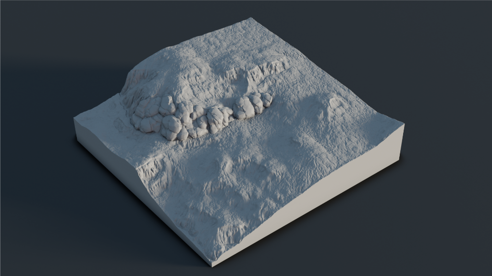
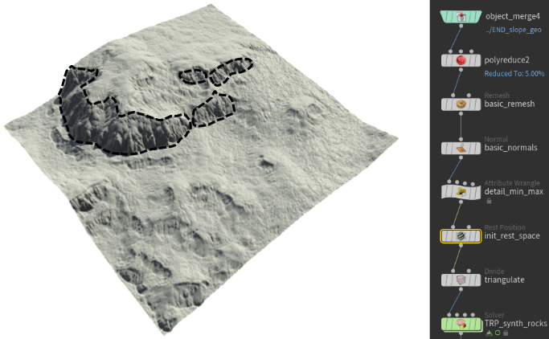
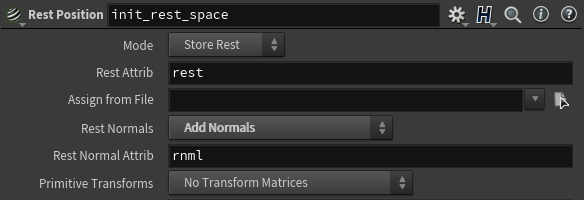
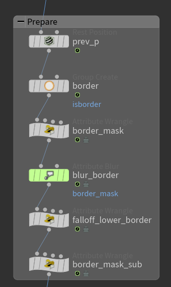

---
tags:
- pcg
- houdini
- computational geometry
---
# Synthetic Rocks

<figure markdown>
{ loading=lazy }
</figure>

## Intro

This document describes the process of "growing" rocks from the

too good. no much on 

Taking apart the article, translating the description into operators

<figure class="video_container">
<vdeo controls="true" allowfullscreen="true">
<source src="../rsr/synthrocks/gradient.webm" type="video/webm">
</video>
<figcaption>Pushing growth towards cracks</figcaption>
</figure>

## Isolate an initialize

<figure markdown>
{ loading=lazy }
<figcaption>Selection from heightfield erosion</figcaption>
</figure>

Text here

=== "Detail"

    ```vex
    // run in detail mode
    vector min, max;
    getpointbbox(0, min, max);
    v@min = min;
    v@max = max;
    ```

=== "Rest"




## Iterative remeshing


Link remeshing edge length to displacement step length

Regular remesher or half edges subdivisions

Calculate edge size for this iteration

<div class="result">
<figure>

</figure>
</div>


```vex title="vex"
//Run over detail
float duration = chf('duration');
float target_size = chramp('remap_duration', @Time / duration);
f@target_size = target_size;
```

```hscript title="hscript"
detail(0,'target_size',0)
```

## Prepare

<div class="t-wrap" markdown>
<div class="t-one" markdown>
For these nodes Lorem ipsum dolor sit amet, consectetur adipiscing elit, sed do eiusmod tempor incididunt ut labore et dolore magna aliqua. Ut enim ad minim veniam, quis nostrud exercitation ullamco laboris nisi ut aliquip ex ea commodo consequat. Duis aute irure dolor in reprehenderit in voluptate velit esse cillum dolore eu fugiat nulla pariatur. Excepteur sint occaecat cupidatat non proident, sunt in culpa qui officia deserunt mollit anim id est laborum.
</div> 
<div class="t-two" markdown>
{width=300}
</div>
</div>


## Regular voronoi

For this example is going to be a static unified noise
This is going to be left for a 

-> Rockmap

  * [ ] Only add domain distortion

## Displacement

In rest space
Interpolation

Boundaries, falloff

Lead normal

Rotate normal

## Growth towards the gaps

Local minimum of the rock map
Reverse


## Collisions

## Other resources

Voronoi cell seed points
https://youtu.be/Q2OUvq4BcFk?list=PLzRzqTjuGIDhiXsP0hN3qBxAZ6lkVfGDI&t=8695
